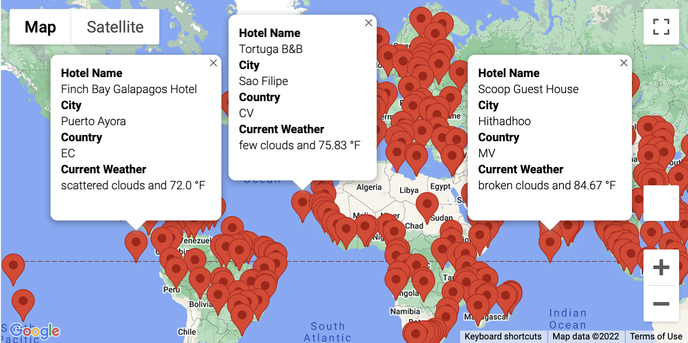

# Plan your trip

## This project is using Google API to help better plan a trip in UK! 

- You define what temperature you prefer!
- The Google will provide city list during the temperate arrange.
  
- Check out which country you would like to take a trip!
  
- Once you have a brief idea about start and stops, we would also use API to pull hotel information! 
  
